# Azure AI Studio Prompt Flow を用いて実現する Advanced RAG

## 概要

[Azure AI Studio](https://azure.microsoft.com/ja-jp/products/ai-studio) で提供されている [Prompt Flow](https://learn.microsoft.com/ja-jp/azure/ai-studio/how-to/prompt-flow) を用いる事で、開発エクスペリエンスの向上、メンテナンス性の向上が実現可能です。
本レポジトリでは Prompt Flow テンプレートのデプロイ、コンテナへの展開、クライアントアプリケーションからの呼び出しまでをカバー範囲とします。

以下に [Copilot Stack](https://news.microsoft.com/ja-jp/features/230524-microsoft-outlines-framework-for-building-ai-apps-and-copilots-expands-ai-plugin-ecosystem/) をベースにした本レポジトリのカバー範囲を図示します。

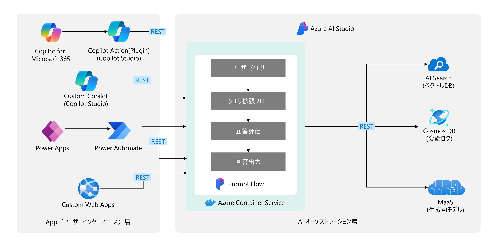

## 事前準備

- GitHubアカウント
- Azureサブスクリプション
- RAG に使用するデータ (Option)

## A. 環境準備と必要リソースの作成

### 1. リポジトリのフォーク

1. GitHubで本リポジトリを開きます。
2. 右上の **Fork** ボタンをクリックし、リポジトリを自分のアカウントにフォークします。

### 2. CodeSpacesのセットアップ

1. フォークしたリポジトリにアクセスします。
2. **Code** ボタンをクリックし、**Create codespace on main** を選択して新しい CodeSpace を作成します。

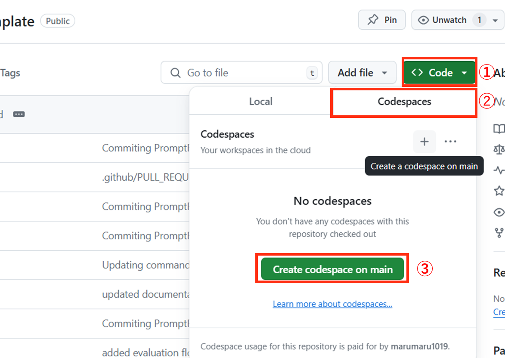


### 3. Python仮想環境の作成と依存関係のインストール

CodeSpace が立ち上がったら、以下のコマンドを実行して Python 仮想環境を作成し、依存関係をインストールします。

```bash
python -m venv .venv
source .venv/bin/activate
pip install -r requirements.txt
```

また、以下のコマンドを使用して [Azure CLI](https://learn.microsoft.com/ja-jp/cli/azure/what-is-azure-cli) と [ML 拡張機能](https://learn.microsoft.com/ja-jp/cli/azure/ml?view=azure-cli-latest)をインストールします。

```:bash
curl -sL https://aka.ms/InstallAzureCLIDeb | sudo bash
az extension add -n ml
```

### 4. Azureにログイン

Azure CLI を使用して、Azureサブスクリプションにログインします。

```bash
az login --use-device-code
```

上記のコマンドを実行すると、下記のようなログが表示されます。[コード認証画面](https://microsoft.com/devicelogin)にアクセスして、表示されるコードを入力してください。

```bash
To sign in, use a web browser to open the page https://microsoft.com/devicelogin and enter the code <コード> to authenticate.
```

### 5. 必要なAzureリソースの作成
scripts/project.sh に環境変数をセットします。

※設定する環境変数は、`RESOURCE_GROUP_NAME`、`HUB_NAME`、`PROJECT_NAME`、`OPENAI_SERVICE_NAME`、`SEARCH_SERVICE_NAME`です。


```:scripts/project.sh
～～～

SUBSCRIPTION_ID=$(az account show --query id -o tsv)
RESOURCE_GROUP_NAME=<任意のリソースグループ名>
LOCATION="eastus"
HUB_NAME=<任意のHub名>
PROJECT_NAME=<任意のプロジェクト名>
OPENAI_SERVICE_NAME=<任意のOpenAIのサービス名>
SEARCH_SERVICE_NAME=<任意のAI Searchのサービス名>

～～～
```


環境変数をセットしたら、以下のコマンドを実行して Azure リソースを作成します。

```bash
sh scripts/create_project.sh
```

デプロイが完了すると、下記のリソースが作成されます。
Azure Portal上からすべてのリソースが作成されていることを確認してください。

- Azure AI Hub
- Azure AI Project
- Azure AI Services
- Azure Key Vault
- Storage Account
- Azure AI Search

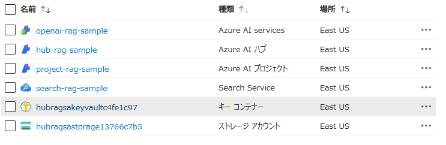

また、ルートディレクトリに`.env`が作成されます。このファイルには、Azureリソースの情報が記載されています。


### 6. Azure AI Studioで接続の作成
下記の手順で Azure AI Studio で OpenAI と AI Search の接続を作成します。
1. [Azure AI Studio](https://ai.azure.com/) にアクセスします。
2. アクセス後、**すべてのプロジェクト** を表示をクリックして、A-5で作成したプロジェクト名を選択します。
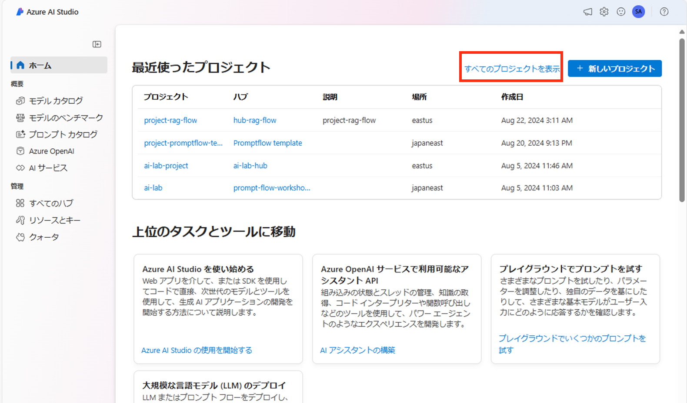
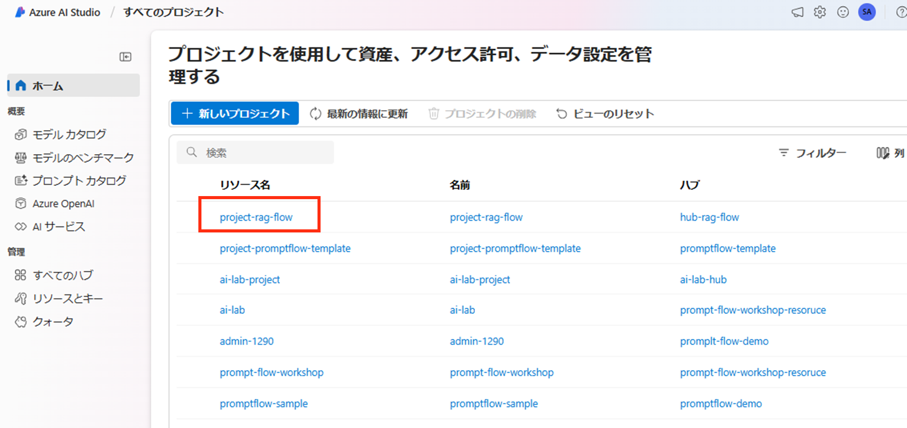

3. 左のナビゲーションバーから **設定** をクリックし、新しい接続を作成します。
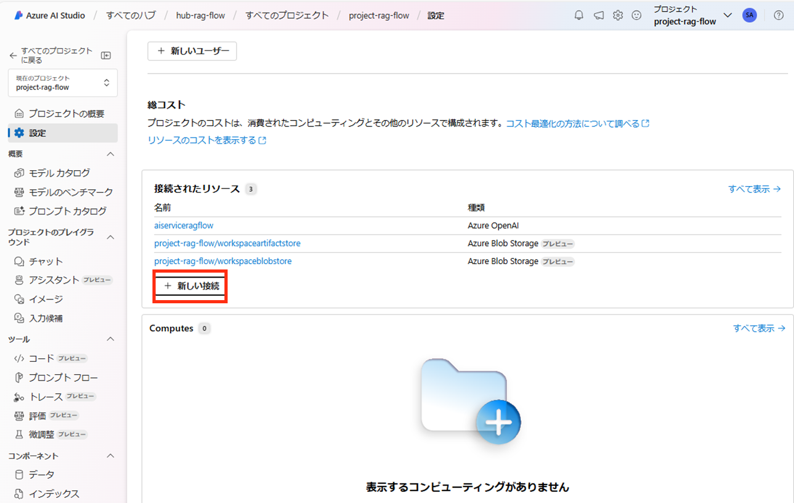

4. OpenAIの接続を作成します。接続一覧から、**Azure AI Services** を選択し、5で作成したリソースに対して **接続を追加する** をクリックします。
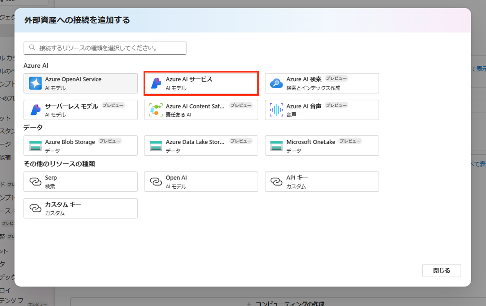
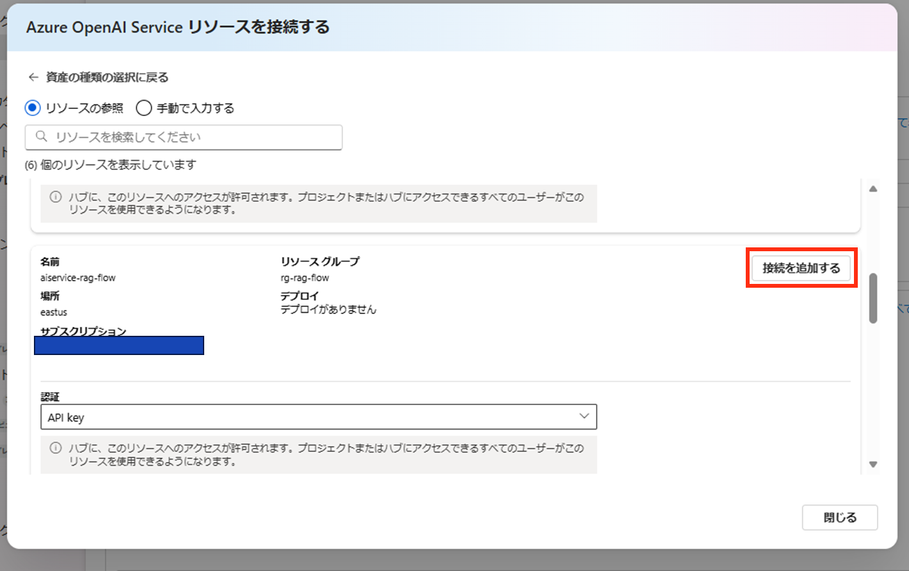

5. 同様の手順で AI Search の接続を作成します。接続一覧から、**Azure AI Services** を選択し、A-5で作成したリソースに対して **接続を追加する** をクリックします。
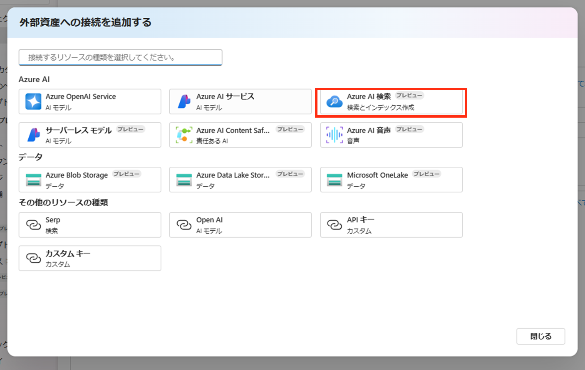


## B. Prompt Flow のインポート
### 1. 環境変数の設定

プロジェクトのルートディレクトリにある`.env`ファイルに、以下の環境変数を追加します。

```env
AZURE_OPENAI_CONNECTION_NAME=your_openai_connection_name
AZURE_SEARCH_CONNECTION_NAME=your_search_connection_name
```

`your_openai_connection_name`と`your_search_connection_name`は、Azure AI Studio で作成した接続の名前に置き換えてください。
接続名は、AI Studio でプロジェクトを選択した後に、左のナビゲーションバーから **設定** をクリックし、接続の一覧を表示し、該当の接続を選択することで確認可能です。
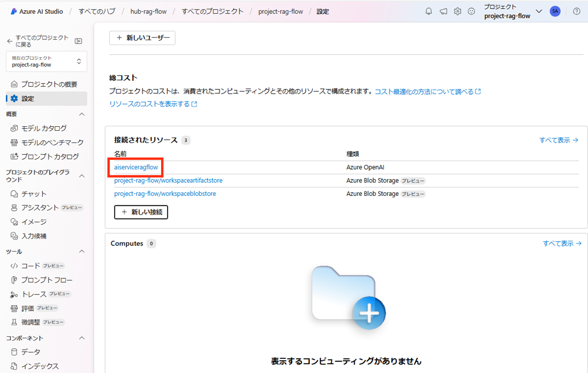
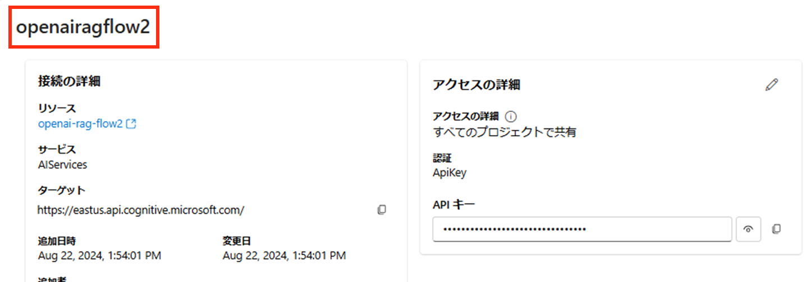

### 2. インデックスの作成

データに基づいてインデックスを作成します。
`indexing/data` ディレクトリにインデックス化したいデータを配置してください。

以下のコマンドを実行することで、インデックスを作成します。


```bash
python -m indexing.build_index --index-name <任意のインデックス名> --path-to-data indexing/data
```

インデックス名を環境変数に追加します。

```env
AZUREAI_SEARCH_INDEX_NAME=your_index_name
```

### 3. Flow の作成と ZIP 化

`src/flow_template` にクエリ拡張のフローが用意されているので、それをアップロードする準備を行います。
以下のコマンドを実行して、フローに今回作成した環境の内容を反映させ、ZIP化します。

```bash
python scripts/create_flow.py
python scripts/create_flow_zip.py
```

これにより、`flow_template.zip` がプロジェクトのルートディレクトリに生成されます。

### 4. Flow のアップロード

1. AI Studio にアクセスします。
2. 左のナビゲーションバーから **プロンプトフロー** を選択し、作成をクリックしてください。下にスクロールするとインポートのセクションがあるので、そこにある **ローカルからアップロード** を選択し、ファイルのアップロードを **Zipファイル** を選択して、B-3で作成したZIPファイルをアップロードしてください。
フォルダー名は任意の名前を設定し、フローの種類は **Standard Flow** に設定してください。
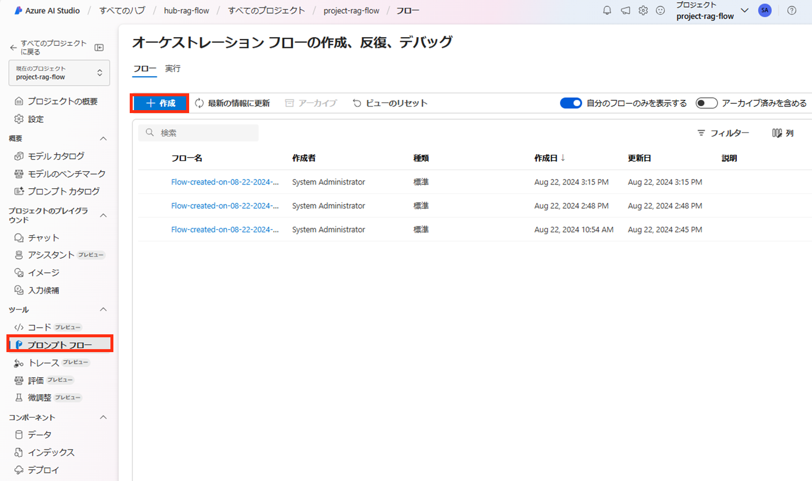
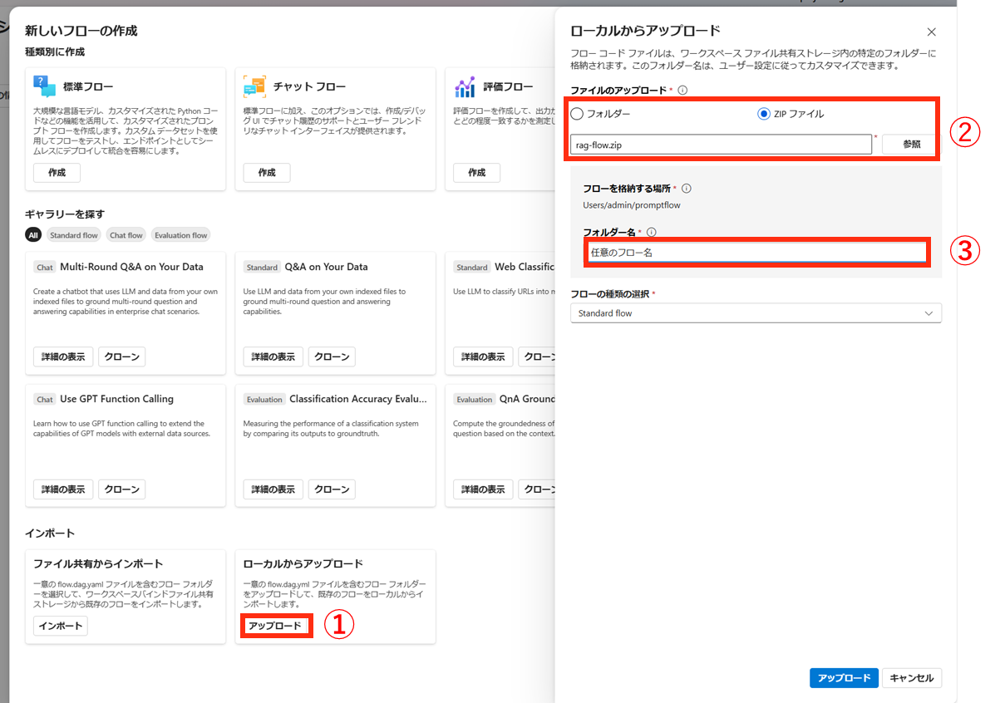

フローをインポートすると、以下のような画面が表示されます。
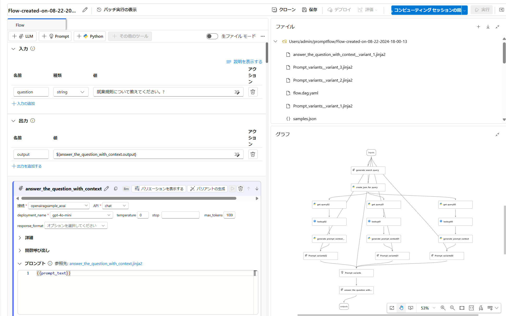


### 5. 動作確認

1. AI Studio でコンピューティングセッションをオンにします。
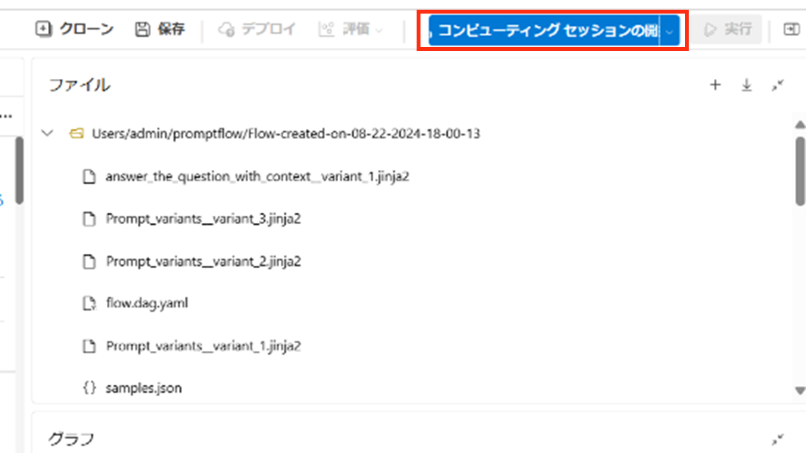

2. フローを実行し、トレース結果を確認します。
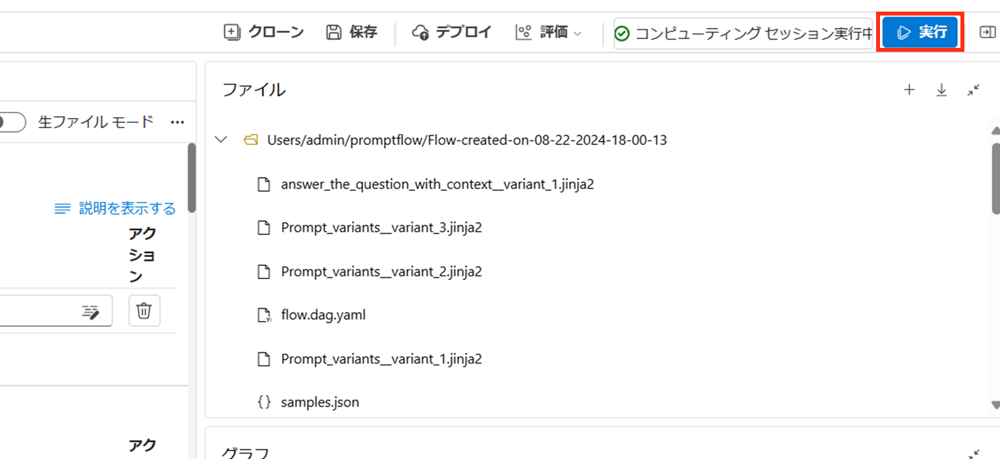
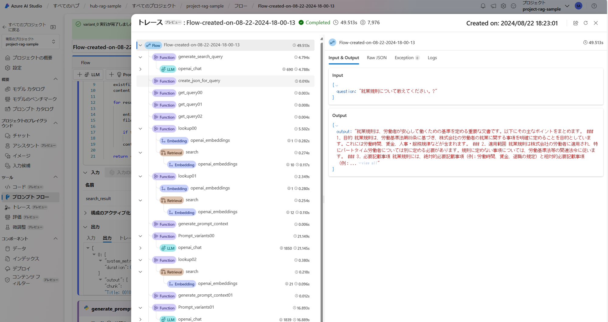

## C. Prompt Flow のコンテナへのデプロイ
以下の手順に従い、作成した Prompt Flow を Docker コンテナとしてデプロイします。

[Deploy a flow using Docker](https://microsoft.github.io/promptflow/how-to-guides/deploy-a-flow/deploy-using-docker.html)

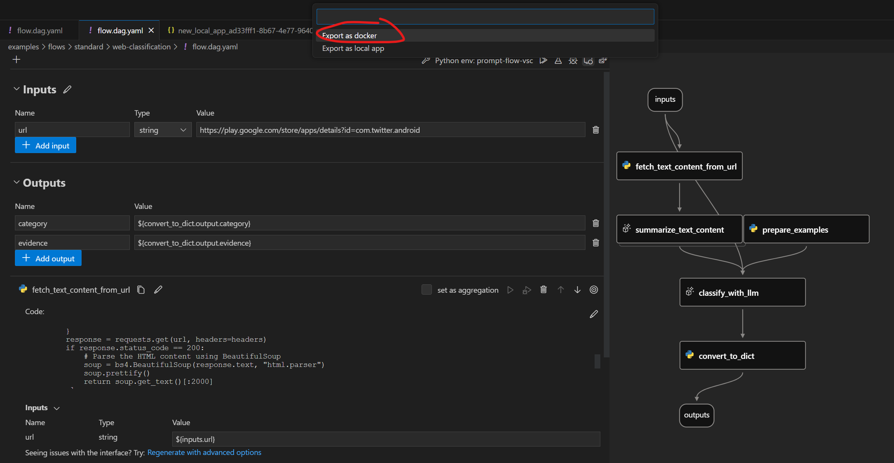

## D. クライアントアプリケーションからの呼び出し
